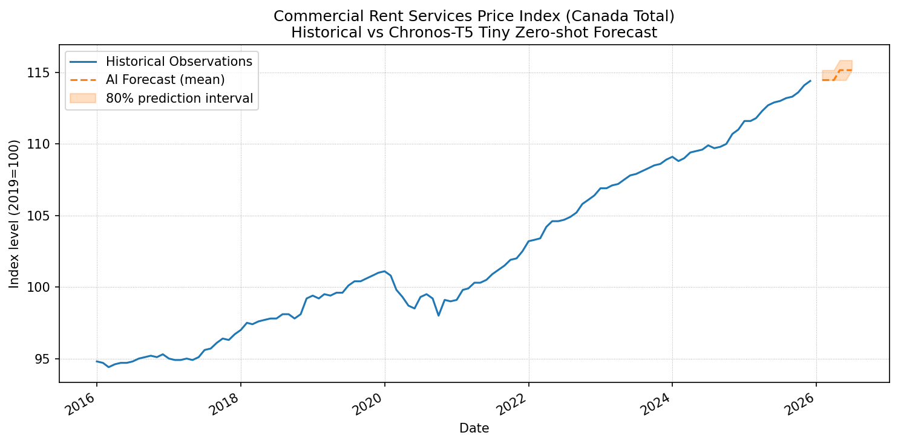

## Autonomous Macro-Forecasting Agent for StatCan CRSPI

This repository maintains an automated data and forecasting pipeline for
Statistics Canada Table 18-10-0255-01 (Commercial Rent Services Price Index).

The GitHub Actions workflow fetches the latest data, runs an AI forecasting
model (Chronos-T5 Tiny), and publishes updated forecasts and a dashboard image.

<!-- FORECAST_SUMMARY_START -->
## Latest CRSPI Macro Forecast

- **Last Observation**: 2025-12 = 114.40
- **MoM Change**: 0.26%
- **Trend Tag**: Neutral

### 6-Month AI Forecast (Chronos-T5 Tiny)

| Month | Mean | P10 | P90 |
| --- | --- | --- | --- |
| 2026-01 | 114.46 | 114.46 | 115.15 |
| 2026-02 | 114.46 | 114.46 | 115.15 |
| 2026-03 | 114.46 | 114.46 | 115.15 |
| 2026-04 | 115.15 | 114.46 | 115.85 |
| 2026-05 | 115.15 | 114.46 | 115.85 |
| 2026-06 | 115.15 | 115.15 | 115.85 |

<!-- FORECAST_SUMMARY_END -->
