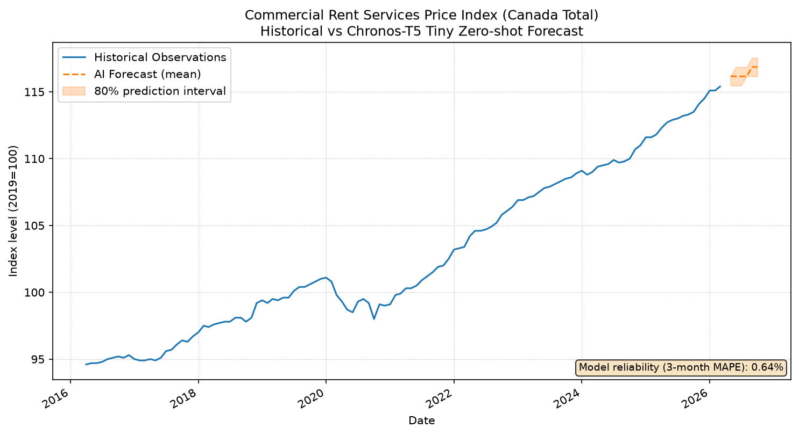

# Continuous Monitoring & Prediction System for Canadian Commercial Real Estate

## System Health

| Metric | Value |
| --- | --- |
| **Last Ingestion Date** | 2025-12-01 |
| **Last Forecast Date** | 2026-04-01 |
| **Model Accuracy (3-month MAPE)** | 0.25% |
| **Data Source** | StatCan Table 18-10-0255-01 (Commercial Rent Services Price Index) |

---

---

## Quick Stats

| Metric | Value |
| --- | --- |
| **Current Index** (Canada, total building type) | 114.40 (2019=100) |
| **MoM Change** | +0.26% |
| **6-Month Forecast** (mean) | 115.50 |
| **Model Accuracy (MAPE)** | 0.25% |

---

## Market Intelligence

The Commercial Rent Services Price Index (Canada, total building type) stands at 114.40 (2019=100), with a month-over-month change of +0.26%. The Chronos-T5 zero-shot forecast projects a upward trend of about 0.9% over the next 6 months. Forecast indicates stabilizing rents with limited near-term volatility.

---

## 6-Month AI Forecast (Chronos-T5 Tiny)

| Month | Mean | P10 | P90 |
| --- | --- | --- | --- |
| 2026-01 | 114.46 | 114.46 | 115.15 |
| 2026-02 | 114.46 | 114.46 | 115.15 |
| 2026-03 | 114.46 | 114.46 | 115.15 |
| 2026-04 | 115.15 | 114.46 | 115.85 |
| 2026-05 | 115.15 | 114.46 | 115.85 |
| 2026-06 | 115.50 | 115.15 | 115.85 |

---
## Technical Methodology

This pipeline uses **Amazon Chronos-T5 (Tiny)** as a **zero-shot foundation model** for time series forecasting. Chronos treats the series as a sequence of tokens and leverages a pretrained language-model-style architecture to generate probabilistic forecasts without task-specific training.

Compared with traditional methods such as **ARIMA**, Chronos is better suited to **non-linear economic cycles** and regime shifts: it has been pretrained on large corpora of diverse time series, so it can capture complex patterns (e.g., post-COVID adjustments, supply shocks) that fixed-parameter ARIMA models often miss.

- **Model**: `amazon/chronos-t5-tiny` (8M parameters)  
- **Inference**: CPU, no gradient computation (`torch.no_grad()`).  
- **Backtesting**: 3-month MAPE is computed by comparing out-of-sample forecasts to realized data.

---

*Updated automatically by GitHub Actions. **main** = stable production; **ai-forecast** = experimental model tuning.*
